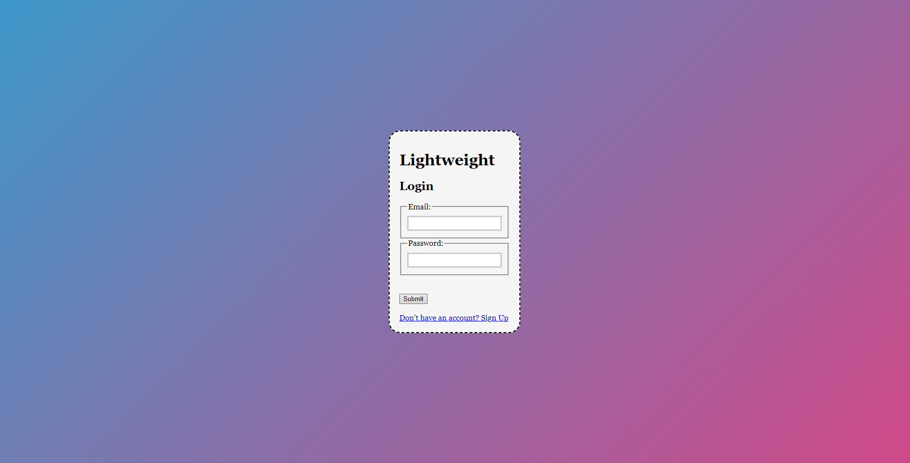
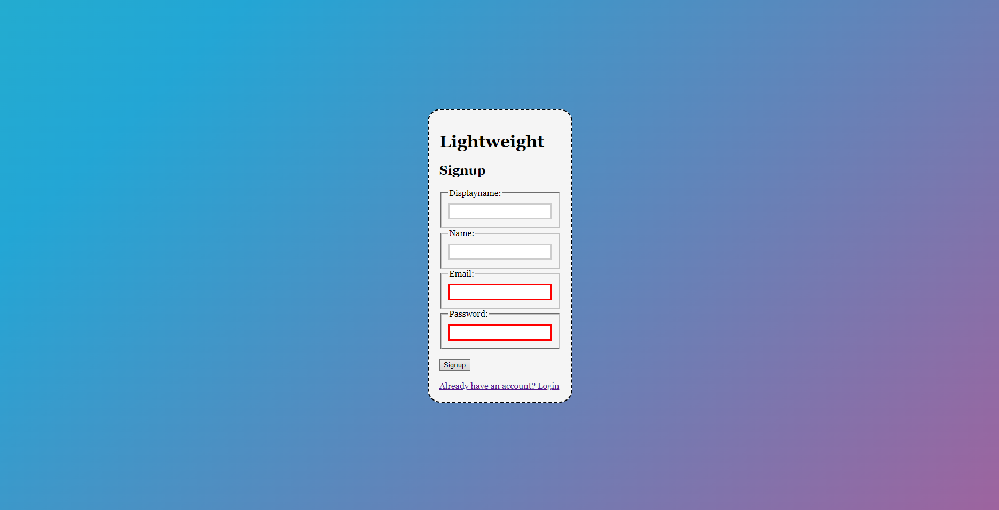
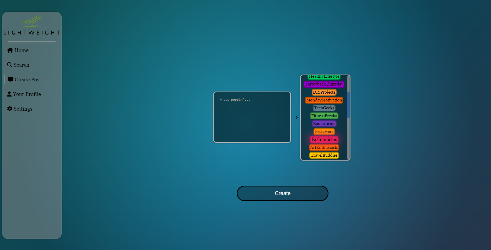
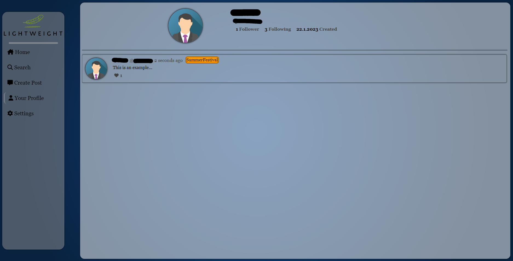

# Social Networking
My own take at a stupid social networking plattform for a school project.
I do not plan to become the next Meta or anything, yea

Also get ready for some shitty code in here, prepare mentally!

## Requirements
1. Node.js 0.10 or higher

## Getting started
```sh
git clone https://github.com/j10a1n15/social-networking.git
cd social-networking
npm install
npm start
```

## Setting up mongodb
I followed [this tutorial](https://youtu.be/-PdjUx9JZ2E) setting up mongodb, so shout out to him!

## Setting up .env
Create an .env file in the main folder.
Use the following template for its content:
```
PORT=
DATABASE_URI=
SESSION_SECRET=
SALT=
```
While PORT, SESSION_SECRET and SALT are optional, DATABASE_URI is required to make the website work.
For information about how you get your own DATABASE_URI check out the info tab above.
It's also recommended to use your own SESSION_SECRET.

## Features

### Login/Signup
Includes password requirements.



### Homepage
Not working yet.


### Posting
Includes tons of selectable flairs.


### Profile
This includes all of your own posts, as well as some actions with those posts.
